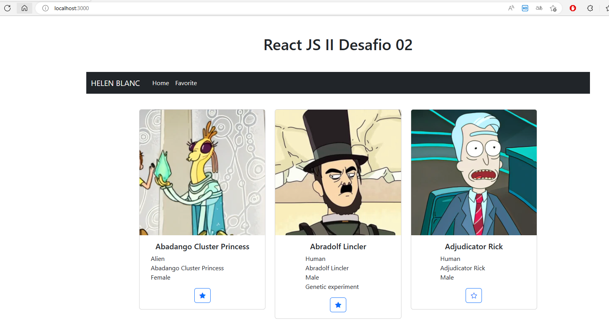
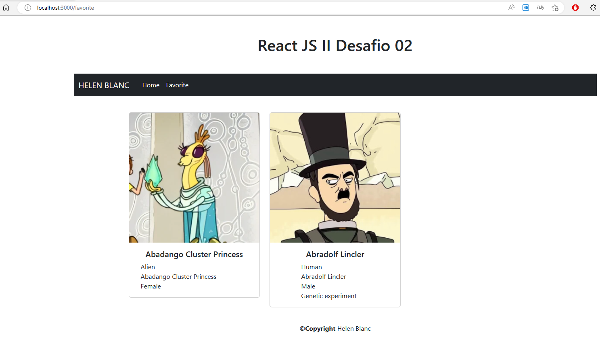

# REACTI_DESAFIO04

React JS II Desafio 02, consumo api rest con personajes de rick y morty utilizando useContext, useState, useEffect.

Cada card tiene un botón para agregar un personaje a la sección de favoritos.

## INSTALAR LIBRERIAS
npm install

## DESPLEGAR
npm run start

